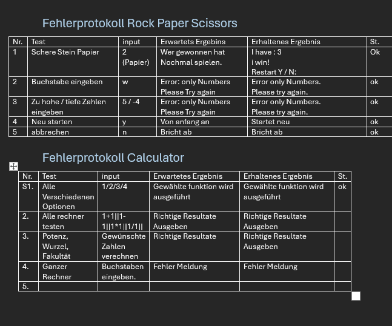

# Dokumentation per IPERKA
## Informieren
 Wir mussten noch einige Dinge klären wie zum Beispiel wie viele Features wir implementieren müssen. Es gibt verschiedene Wahlfeature-Blöcke und wir brauchen mindestens ein zusätzliches Feature. Wir mussten noch klären was ein Fakultät ist (mit K.I natürlich).
## Planen
#### Arbeitsschritte
1. Informieren über die programmierung der grundoperationen.
2.  Die Grundstruktur festlegen.  Zuerst programmieren wir welchen rechner der user auswählen kann und dann mit dem rechner
3. Rollen zuteilen. 
4. Grundanforderungen Programmieren
5. Erweiterte Anforderung programmieren
6. Zeit?
7. Falls ja, noch ein feature
8. Code Review untereinander
9. Testingprotokoll
10. Reflexion
11. DoD

### Rollen
Julian: Grundtaschenrechner -> Potenzen und Wurzeln und die Fakultät  
Ramon: Scheren, Stein, Papier programmiert und das Testing Protokoll gemacht / Return to         
Amina: Grundtaschenrechner -> Plus und Minus, Multiplikation und Division   
*(Ilija:  = nicht präsent)*
David:  U.I erstellen, Powerpoint machen und Dokumentation
##### Deadlines
*19.09* extra feature auswähllen  
*(19.09 Grundrechner erstellen)*  
*24.09* Falls nicht fertig Rechner fertigstellen  
*24.09* die U.I erstellen  
*25.09* mind 1 Optionales Feature fertig haben  
*(26.09 zeit? extra EXTRA feature fertig machen)*  
*26.09* Reflexion und Präsentation erstellen  

## Entscheiden
### Entscheidungsmatrix 
##### A: 1.2.2 Wahlfeature-Block Geometrie
##### B: 1.2.3 Wahlfeature-Block Algebra
##### C: 1.2.4 Wahlfeature-Block "Life" Science
##### D: 1.2.5 Wahlfeature-Block Scheren-Stein-Papier

Wir entschieden uns für Schere, Stein, Papier.
## Realisieren
###Ramon Realisieren
Ich war für das Rock Paper Scissor zuständig und habe es erfolgreich abgeschlossen. Ich habe zuerst nachgeschaut wie man einen Zufallsgenerator machen kann. Danach habe ich alle möglichkeiten in einem eigenen IF Statement aufgeschrieben. Danach ist mir aufgefallen, dass man das viel einfacher machen kann. Wenn ich probleme oder unklahrheiten hatte wendete ich mich an meine Teammitglieder wenn sie mir nicht helfen konnten dann habe ich mich an die Ausbildner gewendet.
### Aminas Code:
Ich habe zuerst nachgeschaut wie man überhaupt plus Rechnungen im C durchführen kann und habe dann auf mein ganz primitives Programm aufgebaut. Bei Fragen wendete ich mich an meine Gruppenmitglieder. Wenn sie nicht helfen konnten ging ich zu einem Ausbildner oder die K.I. Ansonsten versuchte ich den Code selbst zu machen. Mein Code war aber sehr limitiert und man konnte nur zwei Zahlen miteinander addieren oder subtrahieren. Also musste ich mein Code neu denken und einen Weg finden, der mehrere Zahlen erlaubt. Bei diesem Schriit liess ich die K.I mir helfen.
## Kontrollieren
### Testing Protokoll

## Auswerten
Das Projekt zum Programmieren eines Taschenrechners verlief insgesamt sehr gut.
Alle grundlegenden Funktionen wie Addition, Subtraktion, Multiplikation und Division konnten erfolgreich umgesetzt werden. Auch die Eingabe und Ausgabe der Werte hat reibungslos funktioniert.
### Selbstkritische Reflexion
### Julian
**Selbstkritische Reflexion:**

Wir konnten uns gut an den Zeitplan halten und hatten sogar immer etwas Puffer, der uns eine psychologische Stärkung war. Wir haben uns zu Beginn genug Zeit genommen, einen guten Plan zu erstellen und besprachen auch oft zwischen durch, was zu tun ist. Dadurch waren wir organisatorisch stabil unterwegs und konnten mit genügend Zeit auf Probleme reagieren. 

 Schwierigkeiten hatte ich zum einen, beim verstehen von Logiken, für die Wurzel, Potenz und Fakultät. Da musste ich mir auch zusätzliche Hilfe von Kollegen und KI holen, vor allem bei den Wurzel hatte ich Schwierigkeiten. Es war zudem umständlich alles bei jedem aktuell zu behalten, da wir minimale Unterschiede in der Entwicklungsumgebung hatten. Das erstellte einen nervigen Error, den wir dank Julia lösen konnten.

 Ich habe das Gefühl, dass ich niemanden ablenkte und mich gut fokussieren konnte. Ich habe meinen eingeteilten Auftrag gemacht, finde jedoch, es wäre gut, dass man ein Resultat aus den Potenz, Wurzel oder Fakultät in anderen Rechner auch benutzen könnte, oder sogar im gleichen Rechner ist. Ich bin mir nicht ganz sicher, ob das im Auftrag so gewünscht ist und jetzt wäre es zu knapp, noch grosse Änderungen durchzuführen. Das könnte ich auch beim nächsten mal mitnehmen: Ich schaue bereits am Anfang beim Informieren, mich informieren, was wichtig ist.

Allgemein glaube ich, dass wir einen soliden, funktionsfähigen Taschenrechner programmiert, der sauber läuft.  Das heisst, wir haben den Auftrag erfüllt, zwar haben wir nicht alle Zusatzfunktionen drin, jedoch haben wir das, was wir haben müssen und bin damit zufrieden. Auch von der Planung und der Dokumentation her, würde ich sagen, haben wir unseren Auftrag erfüllt.

Wie schon erwähnt, finde ich, dass wir eine sehr gute Kommunikation in unserer Gruppe hatten, die uns einen Vorteil erschuf.

In weiteren Projekten ist es sinnvoll, die Kommunikation beizubehalten, sie war ausschlaggebend, um  Missverständnisse zu vermeiden und dass wir auf Fehler reagieren konnten. Wir könnten klarer bestimmen, wie wir uns das Repository aufteilen, um Probleme im GitHub zu vermindern. Das ist zur Zeit noch schwierig, da wir noch unerfahren mit GitHub sind und es nicht optimal nutzen können.

Ich finde es war zusätzlich sehr Praktisch in einer Gruppe zu arbeiten, in der sich alle gut verstehen. Dadurch gab es keine Streite, schlechte Laune oder Kommunikation.

### David 
**Selbstkritische Reflexion**

Weil ich letzte Woche, am Donnerstag und Freitag krank war, konnte ich erst diese Woche am Mittwoch anfangen. Ich habe versucht viel wie möglich zu helfen, desswegen habe ich das Menü vom Taschenrechner codiert und Powerpoint gemacht.
Die Umsetzung verlief ohne größere Schwierigkeiten, da die Aufgaben klar verteilt waren und alle zuverlässig gearbeitet haben.

Auch die Zusammenarbeit im Team war sehr angenehm. 
Wir haben offen und regelmäßig kommuniziert, wodurch Missverständnisse vermieden werden konnten. 

Besonders positiv war die klare Struktur und Aufgabenverteilung, die wir in dieser Arbeit genutzt haben. 

Für zukünftige Projekte möchte ich mir wünschen, dass wir diese gute Zusammenarbeit beibehalten. 

Als kleinen Verbesserungspunkt sehe ich, dass wir vielleicht noch mehr Zwischenschritte oder Checkpoints einplanen könnten, um den Fortschritt kontinuierlich im Blick zu behalten. 

Darüber hinaus habe ich durch die Arbeit auch meine Kenntnisse in der Programmiersprache C vertieft und gemerkt, wie wichtig es ist, den Code nicht nur funktionsfähig, sondern auch verständlich und gut dokumentiert zu gestalten. Das hat den Austausch in der Gruppe erleichtert und gleichzeitig dafür gesorgt, dass alle einen Überblick über den Entwicklungsstand behalten konnten. 

Insgesamt war die Arbeit für mich nicht nur erfolgreich, sondern auch eine gute Gelegenheit, praktische Erfahrungen in der Teamarbeit und im Programmieren zu sammeln.

### Amina 
**Selbstkritische Reflexion**

Ich finde, dass unser Zeitplan sehr gut eingehalten worden ist. Wir hatten unsere Termine sehr realistisch eingeplant und geraten deswegen nicht in den Zeitstress.

Unser Code hat gut funktioniert und die Teamarbeit war sehr gut. Alle haben ihre Aufgaben erledigt und die auch gut. Ausserdem ist die Arbeit sehr fair aufgeteilt worden. Niemand hat das Projekt sozusagen ge-"carried" und wir konnten alle etwas beitragen.

Es gab schwiereigkeiten in der Technik. Bei einigen, wie zum Beispiel bei mir, wollte der Code einfach nicht funktionieren. Nach vielem knobeln mit der lieben Julia, funktionierte er. Häufig war am Anfang das Problem, dass jemand nicht pushen/pullen konnte oder zu wenigb rechte hatte. Trotzdem kamen wir gut voran und gegen den Schluss waren wir alle komplett synchroniesiert.

Ich schätze meinen Beitrag  als gut ein. Den Grundcalc habe nämlich ich (mithilfe von Google und Gemini) erstellt und es funktioniert auch sehr gut. Ausserdem habe ich zwischendurch auch mal geholfen wo ich konnte. Die Dokumentationsvorlage erstellt habe auch ich erstellt. Ich gab mir mühe und konnte gutes beitragen. Natürlich habe ich mir trotzdem Hilfe geholt!

Die Gesamtleistung habe ich jetzt als fair und produktive empfunden. Jeder hatte was zu tun. Klar einige weniger als andere, aber das nur weil sie einen späten Start hatten (oder überhaupt nicht da waren). Ausserdem konnte ich vieles lernen und auch mein Grundwissen nochmals um einiges verbessern (ahem ahem schleifen). Jede Person hat ein Komponent beigetragen ohne den, das Ganze nicht funktionieren würde. Ich habe eher die Rolle eines Supports und Dirigents gespielt. Man kam zu mir nicht um konkrete Unterstützung sondern wahrscheinlich für kleine Hilfreiche Tipps, da ich noch nicht wirklich eine Ahnung habe. Ich muss aber sagen, dass diese Gruppe das angenehmste und produktivstes Team war in dem ich je gearbeitet habe.

Die Kommunikation war sehr gut. Ich wusste genau an was alle waren und auch umgekehrt. Julian hat immer nachgefragt was alle am machen waren und wir haben uns in unserem Gruppenchat ständig ausgetauscht. Die Kommunikation war also definitiv da. Leider waren nicht alle präsent. Mit Ilija hatte ich zumindest überhaupt kein Kontakt.

Für das nächste Mal sollte die Zusammenarbeit beibehalten werden. Ausserdem der Fleiss und die Kommunikation, da hauptsächlich durch das wir so weit voran kamen. Definitiv auch die Offenheit, da ich nie die Lust auf das Projekt wegen meinen Mitglieder verloren habe. Ausserdem konnten wir einander gut aushelfen und unterstützen.

Die Konzentration könnte besser laufen und wir hätten mit der übrigen Zeit vielleicht etwas simples dazu tun. Ausserdem hätte ich besonders, weniger K.I benutzen können. Sonst habe ich ehrlichgesagt nichts zu melden, da diese Teamarbeit die Geschmeidigste Teamarbeit ist die ich je gemacht habe und ich wirklich glücklich mit unserem Endprodukt bin.
### Ramon
**Selbstkritische Reflexion**

Der Zeitplan wurde meiner Meinung nach gut eingehalten. Die Grundstruktur war innerhalb der abgemachten Zeit fertig.
•	Ich finde, dass wir alle sehr gut zusammengearbeitet haben. Wir haben die Arbeit gut aufgeteilt und haben uns gegenseitig gut unterstützt.

•	Für mich Persönlich war das grösste Problem beim Coden. Ich hatte ein Problem, dass ich lange nicht lösen konnte, was mir sehr viel Wertvolle Zeit 	geraubt hat.

•	Ich glaube ich habe der Gruppe gut geholfen, da ich ein Zusatzfeature programmiert habe und den Return to Menu Loop gemacht habe.

•	Ich finde wir haben immer alles gut kommuniziert da wir eine Teams Gruppe hatten, wo wir uns ausgetauscht haben. Wir haben uns auch gegenseitig über 	Änderungen informiert.

•	Die Kommunikation und die Zusammenarbeit soll in der nächsten Gruppenarbeit beibehalten werden.

•	Wir könnten konzentrierter arbeiten. Und uns weniger über nicht Firmen interne Gespräche austauschen.

