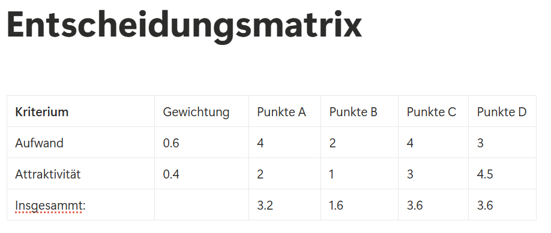

# Dokumentation per IPERKA
## Informieren
 Wir mussten noch einige Dinge klären wie zum Beispiel wie viele Features wir implementieren müssen. Es gibt verschiedene Wahlfeature-Blöcke und wir brauchen mindestens ein zusätzliches Feature. Wir mussten noch klären was ein Fakultät ist (mit K.I natürlich).
## Planen
#### Arbeitsschritte
1. Informieren über die programmierung der grundoperationen.
2.  Die Grundstruktur festlegen.  Zuerst programmieren wir welchen rechner der user auswählen kann und dann mit dem rechner
3. Rollen zuteilen. 
4. Grundanforderungen Programmieren
5. Erweiterte Anforderung programmieren
6. Zeit?
7. Falls ja, noch ein feature
8. Code Review untereinander
9. Testingprotokoll
10. Reflexion
11. DoD

### Rollen
Julian: Grundtaschenrechner -> Potenzen und Wurzeln und die Fakultät  
Ramon: Scheren, Stein, Papier programmiert und das Testing Protokoll gemacht
Amina: Grundtaschenrechner -> Plus und Minus, Multiplikation und Division   
*(Ilija:  = nicht präsent* )  
David:  U.I erstellen, Powerpoint machen und Dokumentation
##### Deadlines
*19.09* extra feature auswähllen  
*(19.09 Grundrechner erstellen)*  
*24.09* Falls nicht fertig Rechner fertigstellen  
*24.09* die U.I erstellen  
*25.09* mind 1 Optionales Feature fertig haben  
*(26.09 zeit? extra EXTRA feature fertig machen)*  
*26.09* Reflexion und Präsentation erstellen  

## Entscheiden
### Entscheidungsmatrix 
##### A: 1.2.2 Wahlfeature-Block Geometrie
##### B: 1.2.3 Wahlfeature-Block Algebra
##### C: 1.2.4 Wahlfeature-Block "Life" Science
##### D: 1.2.5 Wahlfeature-Block Scheren-Stein-Papier

->Wir entschieden uns für Schere, Stein, Papier.
## Realisieren

## Kontrollieren
### Testing Protokoll
## Auswerten
Das Projekt zum Programmieren eines Taschenrechners verlief insgesamt sehr gut.
Alle grundlegenden Funktionen wie Addition, Subtraktion, Multiplikation und Division konnten erfolgreich umgesetzt werden. Auch die Eingabe und Ausgabe der Werte hat reibungslos funktioniert.
### Selbstkritische Reflexion
### Julian
**Selbstkritische Reflexion:**

Wir konnten uns gut an den Zeitplan halten und hatten sogar immer etwas Puffer, der uns eine psychologische Stärkung war. Wir haben uns zu Beginn genug Zeit genommen, einen guten Plan zu erstellen und besprachen auch oft zwischen durch, was zu tun ist. Dadurch waren wir organisatorisch stabil unterwegs und konnten mit genügend Zeit auf Probleme reagieren. 

 Schwierigkeiten hatte ich zum einen, beim verstehen von Logiken, für die Wurzel, Potenz und Fakultät. Da musste ich mir auch zusätzliche Hilfe von Kollegen und KI holen, vor allem bei den Wurzel hatte ich Schwierigkeiten. Es war zudem umständlich alles bei jedem aktuell zu behalten, da wir minimale Unterschiede in der Entwicklungsumgebung hatten. Das erstellte einen nervigen Error, den wir dank Julia lösen konnten.

 Ich habe das Gefühl, dass ich niemanden ablenkte und mich gut fokussieren konnte. Ich habe meinen eingeteilten Auftrag gemacht, finde jedoch, es wäre gut, dass man ein Resultat aus den Potenz, Wurzel oder Fakultät in anderen Rechner auch benutzen könnte, oder sogar im gleichen Rechner ist. Ich bin mir nicht ganz sicher, ob das im Auftrag so gewünscht ist und jetzt wäre es zu knapp, noch grosse Änderungen durchzuführen. Das könnte ich auch beim nächsten mal mitnehmen: Ich schaue bereits am Anfang beim Informieren, mich informieren, was wichtig ist.

Allgemein glaube ich, dass wir einen soliden, funktionsfähigen Taschenrechner programmiert, der sauber läuft.  Das heisst, wir haben den Auftrag erfüllt, zwar haben wir nicht alle Zusatzfunktionen drin, jedoch haben wir das, was wir haben müssen und bin damit zufrieden. Auch von der Planung und der Dokumentation her, würde ich sagen, haben wir unseren Auftrag erfüllt.

Wie schon erwähnt, finde ich, dass wir eine sehr gute Kommunikation in unserer Gruppe hatten, die uns einen Vorteil erschuf.

In weiteren Projekten ist es sinnvoll, die Kommunikation beizubehalten, sie war ausschlaggebend, um  Missverständnisse zu vermeiden und dass wir auf Fehler reagieren konnten. Wir könnten klarer bestimmen, wie wir uns das Repository aufteilen, um Probleme im GitHub zu vermindern. Das ist zur Zeit noch schwierig, da wir noch unerfahren mit GitHub sind und es nicht optimal nutzen können.

Ich finde es war zusätzlich sehr Praktisch in einer Gruppe zu arbeiten, in der sich alle gut verstehen. Dadurch gab es keine Streite, schlechte Laune oder Kommunikation.
### David 
**Selbstkritische Reflexion:**

Weil ich letzte Woche, am Donnerstag und Freitag krank war, konnte ich erst diese Woche am Mittwoch anfangen. Ich habe versucht viel wie möglich zu helfen, desswegen habe ich das Menü vom Taschenrechner codiert und Powerpoint gemacht. 

Die Umsetzung verlief ohne größere Schwierigkeiten, da die Aufgaben klar verteilt waren und alle zuverlässig gearbeitet haben. Mit meinem Beitrag bin ich zufrieden. Auch die Zusammenarbeit im Team war sehr angenehm. 

Wir haben offen und regelmäßig kommuniziert, wodurch Missverständnisse vermieden werden konnten. Besonders positiv war die klare Struktur und Aufgabenverteilung, die wir in dieser Arbeit genutzt haben. Für zukünftige Projekte möchte ich mir wünschen, dass wir diese gute Zusammenarbeit beibehalten. 

Darüber hinaus habe ich durch die Arbeit auch meine Kenntnisse in der Programmiersprache C vertieft und gemerkt, wie wichtig es ist, den Code nicht nur funktionsfähig, sondern auch verständlich und gut dokumentiert zu gestalten. 

Das hat den Austausch in der Gruppe erleichtert und gleichzeitig dafür gesorgt, dass alle einen Überblick über den Entwicklungsstand behalten konnten. 

Insgesamt war die Arbeit für mich nicht nur erfolgreich, sondern auch eine gute Gelegenheit, praktische Erfahrungen in der Teamarbeit und im Programmieren zu sammeln. Ich konnte mich sehr gut Konzentrieren
